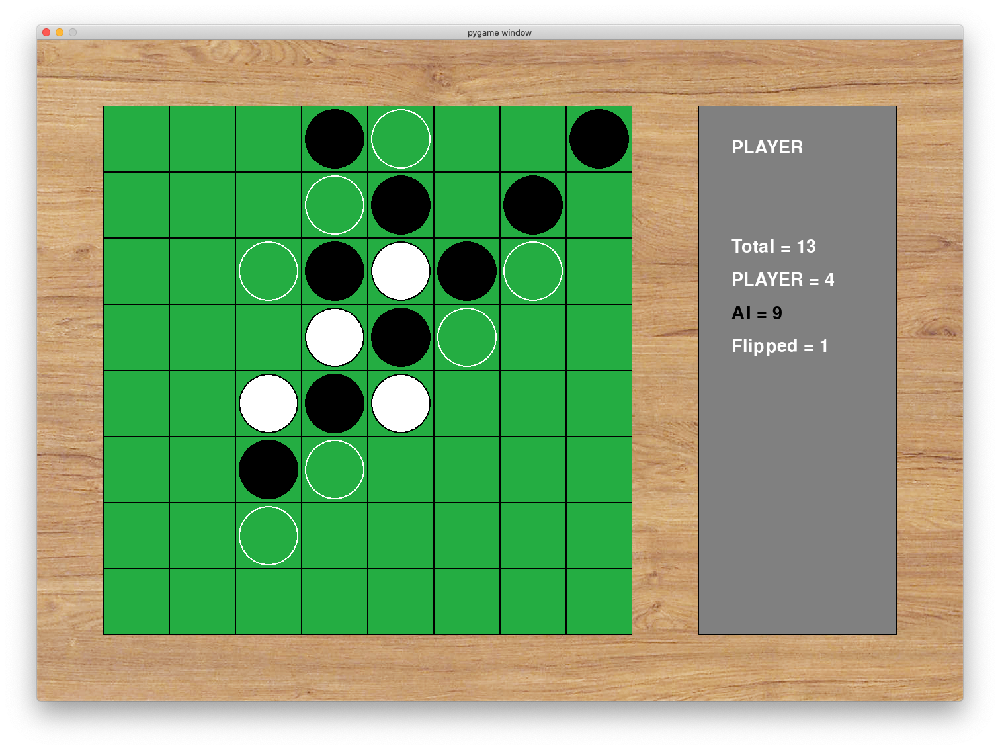

<h1>Reversal ⚪️⚫️</h1>

 

<h2>Table of Contents</h2>

- [1. Quick Start](#1-quick-start)
  - [1.1. Error Messages](#11-error-messages)
  - [1.2. Packages required](#12-packages-required)
- [2. Functions/ Methods](#2-functions-methods)
  - [2.1. Basic Operations of the game](#21-basic-operations-of-the-game)
  - [2.2. Methods for the AI version](#22-methods-for-the-ai-version)
  - [2.3. Debugging, Blitting on Pygame window](#23-debugging-blitting-on-pygame-window)
- [3. Plans for the future](#3-plans-for-the-future)
- [4. A brief collection of things I have read (at the moment)](#4-a-brief-collection-of-things-i-have-read-at-the-moment)

I was watching a [tutorial](https://www.youtube.com/playlist?list=PLFCB5Dp81iNV_inzM-R9AKkZZlePCZdtV) on creating connect4 on python recently, and I wondered whether I could do the same for reversal/ orthello, one of my favourite board games. So that's what I did!

The game is being iteratively developed and updated, which means that the descriptions below only reflect the newest version of the program. For more information on the past iterations of the game, check out the [log](log.md).

# 1. Quick Start

For a quick look on how to play with the command line version, have a look at the [jupyter notebook](reversal_test.ipynb) or a [pdf version of the jupyter notebook](reversal_test.pdf).

To run the [command line version](reversal.py), type the following in your terminal:

    python3 ./reversal.py

Nevertheless, I have pretty much stopped updating the command line version ever since I started working on the GUI version. This is programmed in [reversal_gui_mac.py](reversal_gui_mac.py), which provides a neat easy-to-use GUI in a pygame window. To run the GUI version, run:

     python3 ./reversal_gui_mac.py

Despite what the name of the file suggests, the game is designed to work on any platform. It's just that I originally used a packgage called `Tkinter` for displaying error messages in additional popup message-boxes. However, this didn't work so well when I was running the program on a Mac🍎, so I decided to display the messages in-game, within the pygame window itself.

To run the newest [AI version](reversal_ai.py) of the game, type the following in your terminal:

    python3 ./reversal_ai.py

Note that the running time of the AI might vary depending on the number of possible moves each round. Sometimes this may take up to 5 seconds. I have mitigated this by using alpha-beta pruning, which uses a binary-search-tree-like method to return results quicker.

Here's a quick screenshot of the newest version of the game.

Currently the interface includes:

- A neat green-colored board with white gridlines, in front of a wooden background
- Black and white pieces (instead of the previous yellow and red pieces)
- Hollow circles to denote the available/legal moves available for the player.
- A gray panel on the right, which shows the total number of pieces on the board, number of pieces for each player, and the number of pieces flipped during the previous turn.

 

## 1.1. Error Messages

In addition, special messages are displayed when appropriate. The special messages available are:

- "Error. Position not valid. Player {turn} go again."
- "Can't Move! Player {turn} cannot move. It is player {next_turn}'s turn."
- "Player {turn} wins!"

## 1.2. Packages required

| Package \ Game version | [`reversal.py` (Command line version)](reversal.py) | [Jupyter Notebook](reversal_test.ipynb) | [`reversal_gui_mac.py` (GUI Version)](reversal_gui_mac.py) | [`reversal_ai.py` (AI Version)](reversal_ai.py) |
|---------|---------|---------|---------|---------|
| `numpy` , `matplotlib` | Y   | Y    | Y   | Y   |
| `pygame`, `sys`, `math`|     |      | Y   | Y   |
| `random`               |     |      |     | Y   |
| `jupyter notebook`     |     | Y    |     |     |

This assumes that you have python3 installed (as well as jupyter notebook installed if you would like to run the notebook).

# 2. Functions/ Methods

Here's the list of methods for this game, sorted in relevant categories.

## 2.1. Basic Operations of the game

1. `create_board()`  
Initialises an empty board (a numpy array) with 4 pieces in the centre.

2. `can_play(board, piece)`  
Determines whether or not the user can place a piece, by performing `is_reversible()` on all vacant spots on the board. (In some cases a player may be inhibited to do so since there is no available spot where a reversal can occur.) This function is no longer used, and is instead replaced by detecting the length of the list of available moves (determined with the function `availoc()`).

3. `orthello(board, row, col, piece, drop)` 
This grand function performs two things:
    1. With the drop boolean set to false, it determines whether the placement of piece will lead to reversals.
    2. With the drop boolean set to true, it actually drops the piece at the desired location, and reverse all the relevant pieces surounding it. This involves finding nearest piece (with opponent in between) in the vertical/hoirzontal/diagonal axis and reversing the pieces. This also returns an integer, which is the number of reversals.

4. `is_end_game(board)`  
Boolean true if all entries on the board are non-zero (so basically the board is full).

5. `is_vacant(board, row, col, piece)`  
Boolean true if location selected by player is vacant.

8. `create_avaiBoard()`  
Initialises another board, which is used for displaying moves (locations) available to the player. At the beginning it is initialised with the moves available to player 1, which are (3,5) (5,3) (2,4) or (4,2).

9. `availoc(board, available_board, piece)`  
Returns a list of available locations for a player, and drops the available move pieces to the `available_board`.

## 2.2. Methods for the AI version

10. `score_position(board, turn, flip_num)`  
Assigns a score for the location specified. Things taken into consideration are advantage points (borders and corners) as well as number of flipped pieces, though the flipped number plays a much smaller role that the aforementioned advantage points (it's just there to add a small offset). It also considers advantage points of the opponent in the next turn. I suspect this may be slightly messing the minimax algorithm, though the somewhat arbitrary nature of the scores may play a role as well.

11. `pick_best_move(board, available_board, turn)`  
[No longer used] It is  used for testing `score-position()`, so it just selects the best location based on scores on the current board only.

12. `minimax(board, depth, alpha, beta, maximizingPlayer, new_row, new_col)`  
This is where the minimax algorithm is implemented, so it recursively calls itself, and calls on `score_position()` when the depth reaches zero. One thing is I don't consider the terminal nodes mentioned in the psuedocode - I'm not quite sure how winning moves applies to a game like Orthello.

## 2.3. Debugging, Blitting on Pygame window

13.  `print_board(board, flip_num)`  
Prints the board (an array in the terminal, as well as a 'heat map' in a jupyter notebook, for better visibility), the total number of pieces on the board, the number of pieces for each player, and the number of flips (reversals) performed.

14. `draw_board(board)`  
Draws the actual board on the GUI pygame window.

15.  `draw_avaiBoard(available_board, turn)`  
Displays the available moves available for a player, shown as a hollow circle of the player's color on the pygame window.

16. `print_special_message(message)`  
Prints error messages on the top, above the player and statistics.

17. `print_statistics(board, turn)`  
Blits relevant statistics on the panel to the right.

18.  `insert(row, col, piece)`  
A function specifically designed for the jupyter workbook, which performs `drop_piece()` and `print_board()`. Note that the notebook does not actually perform verification steps such as `can_play()`, `is_vacant()`, `is_reversible()`.

# 3. Plans for the future

- To create a more beautiful graphical user interface for this game.
- Create a (better) AI to play with me......? Perhaps a bit too far fetched for me right now, but gonna look into it. Maybe I can utilise deep learning (wow) or perhaps the relatively straightforward minimax algorithm (sort of doing this?).
- And of course, to fix any bugs that I find throughout the way.

# 4. A brief collection of things I have read (at the moment)

1. https://github.com/KeithGalli/Connect4-Python
2. https://www.youtube.com/playlist?list=PLFCB5Dp81iNV_inzM-R9AKkZZlePCZdtV