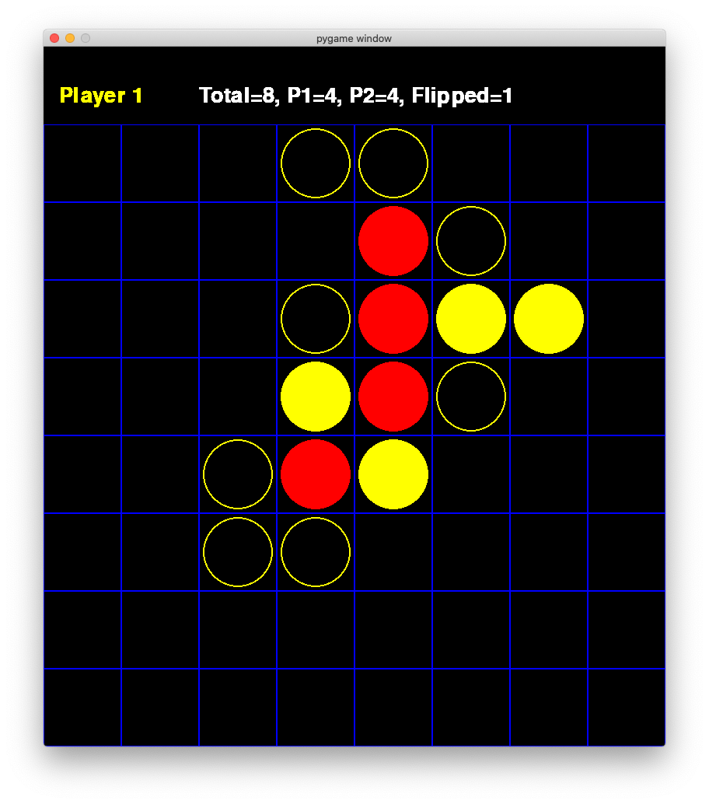

<h1>Reversal ⚪️⚫️</h1>

- [1. Functions](#1-functions)
- [2. Quick Start](#2-quick-start)
  - [2.1. Error Messages](#21-error-messages)
  - [2.2. Packages required](#22-packages-required)
- [3. Plans for the future](#3-plans-for-the-future)

I was watching a tutorial on creating connect4 on python recently, and I wondered whether I could do the same for reversal/ orthello, one of my favourite board games. So that's what I did!

# 1. Functions

The functions are being iteratively updated throughout the development of the game. Hence, the descriptions below only reflect the newest version of theprogram.

Here's the list of functions for this game:

1. `create_board()`  
Initialises an empty board (a numpy array) with 4 pieces in the centre.

2. `can_play(board, piece)`  
Determines whether or not the user can place a piece, by performing `is_reversible()` on all vacant spots on the board. (In some cases a player may be inhibited to do so since there is no available spot where a reversal can occur.) This function is no longer used, and is instead replaced by detecting the length of the list of available moves (determined with the function `availoc()`).

3. `orthello(board, row, col, piece, drop)` 
This grand function performs two things:
    1. With the drop boolean set to false, it determines whether the placement of piece will lead to reversals.
    2. With the drop boolean set to true, it actually drops the piece at the desired location, and reverse all the relevant pieces surounding it. This involves finding nearest piece (with opponent in between) in the vertical/hoirzontal/diagonal axis and reversing the pieces. This also returns an integer, which is the number of reversals.

4. `is_end_game(board)`  
Boolean true if all entries on the board are non-zero (so basically the board is full).

5. `is_vacant(board, row, col, piece)`
Boolean true if location selected by player is vacant.

6. `print_board(board, flip_num)`  
Prints the board (both actual terminal output and a 'heat map' for better visibility), the total number of pieces on the board, the number of pieces for each player, and the number of flips (reversals) performed.

7. `insert(row, col, piece)`  
A function specifically designed for the jupyter workbook, which performs `drop_piece()` and `print_board()`. Note that the notebook does not actually perform verification steps such as `can_play()`, `is_vacant()`, `is_reversible()`.

8. `print_board(board, flip_name)`
Prints the board (as an array), the scores and the number of flipped pieces in the terminal.

9. `draw_board(board)`
Draws the actual board on the GUI pygame window.

10. `create_avaiBoard()`
Initialises another board, which is used for displaying moves (locations) available to the player. At the beginning it is initialised with the moves available to player 1, which are (3,5) (5,3) (2,4) or (4,2).

11. `availoc(board, available_board, piece)`
Returns a list of available locations for a player, and drops the available move pieces to the `available_board`.

12. `draw_avaiBoard(available_board, turn)`
Displays the available moves available for a player, shown as a hollow circle of the player's color on the pygame window.

13. `print_special_message(message):`
Prints error messages on the top, above the player and statistics.

# 2. Quick Start

For a quick look on how to play with the command line version, have a look at the [jupyter notebook](reversal_test.ipynb) or a [pdf version of the jupyter notebook](reversal_test.pdf).

The actual game is programmed in [reversal.py](reversal.py). To run the command line version, type the following in your terminal:

    python3 ./reversal.py

Nevertheless, I have pretty much stopped updating the command line version ever since I started working on the GUI version. Arguably the most refined and bug-free version of the game is programmed in [reversal_gui_mac.py](reversal_gui_mac.py) which provides a neat easy-to-use GUI. To run the GUI version, run:

     python3 ./reversal_gui_mac.py

Despite what the name of the file suggests, the game is designed to work on any platform. It's just that I originally used a packgage called `Tkinter` for displaying error messages in additional popup message-boxes. However, this didn't work so well when I was running the program on a Mac🍎, so I decided to display the messages in-game, within the pygame window itself.

Here's a quick screenshot of the game. As you can see, the interface displays the locations available for the player as well.

 

## 2.1. Error Messages

In addition, special messages are displayed when appropriate. The special messages available are:

- "Error. Position not valid. Player {turn} go again."
- "Can't Move! Player {turn} cannot move. It is player {next_turn}'s turn."
- "Player {turn} wins!"

## 2.2. Packages required

| Package \ Game version | [`reversal.py` (Command line version)](reversal.py) | [Jupyter Notebook](reversal_test.ipynb) | [`reversal_gui_mac.py` (GUI Version)](reversal_gui_mac.py) |
|---------|-----------|---------|------------|
| `numpy`                | Y   | Y    | Y   |
| `matplotlib`           | Y   | Y    | Y   |
| `pygame`               |     |      | Y   |

This assumes that you have python3 installed (as well as jupyter notebook installed if you would like to run the notebook).

# 3. Plans for the future

- To create a more beautiful graphical user interface for this game.
- Create an AI to play with me......? Perhaps a bit too far fetched for me right now, but gonna look into it. Maybe I can utilise deep learning (wow) or perhaps the relatively straightforward minimax algorithm.
- And of course, to fix any bugs that I find throughout the way.